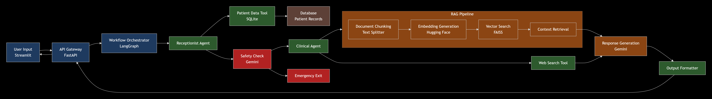

# Medical AI Assistant: Post-Discharge Care POC

**A multi-agent AI system built with LangGraph that provides intelligent post-discharge medical assistance. Features patient identification, safety checks, RAG-based medical knowledge retrieval, and emergency response handling.**

---

# 1. Overview

**Medical AI Assistant: Post-Discharge Care POC** is a proof-of-concept system that demonstrates a multi-agent approach to post-discharge patient support. The system is intended for demonstration and research purposes only and is **not** a substitute for professional medical advice. All responses must include a medical disclaimer and emergency handling policy.

---
# 2. Features

**Core Capabilities**

- **Multi-Agent Architecture:** LangGraph state machine orchestrates receptionist, clinical, and safety agents.
- **Patient Data Integration:** SQLite database stores structured discharge reports for retrieval.
- **Medical RAG Pipeline:** FAISS vector store built from domain-specific documents using Hugging Face embeddings (nephrology reference included).
- **Safety-First Design:** Google Gemini-powered urgency detection and emergency exit protocols.
- **Streamlit Frontend:** Minimal, clean interface for patient interactions.
- **Comprehensive Logging:** Conversation logging for audit trails and debugging.

---

# 3. Architecture

## High-level Flow

Streamlit UI → FastAPI Backend → LangGraph Orchestration → Multi-Agent System → Data Layer

## Low-level-Architecture



---
## Demo Video
[▶️ Watch the demo](https://github.com/srishtigar/medai/raw/main/working_poc_application.mp4)
---

---

# 4. System Components

| **Component** | **Description** |
|----------------|-----------------|
| **Frontend Layer** | Streamlit web UI for patient interactions and simple admin views. |
| **API Layer** | FastAPI provides REST endpoints for message processing, patient retrieval, and safety checks. |
| **Orchestration** | LangGraph state machine orchestrates agent invocation and context passing between agents. |
| **Agent Layer** | **Receptionist Agent:** Authenticates or identifies patient records, manages session metadata.<br> **Clinical Agent:** Executes RAG retrieval, composes answers, supplements responses with web search when needed.<br> **Safety Agent:** Runs urgency detection, executes emergency exit protocol, and ensures disclaimers are attached. |
| **RAG Pipeline** | Document chunking with semantic overlap for context continuity.<br> Embeddings via Hugging Face models.<br> FAISS for similarity search and efficient retrieval.<br> Context augmentation and response generation via the chosen LLM. |
| **Data Layer** | SQLite for discharge reports and patient metadata.<br> FAISS indexes and docstore for RAG retrieval.<br> Local `data/` folder for PDFs, JSONs, and DB files. |

---

# 5. Tech Stack

| Category | Tools / Frameworks |
|-----------|--------------------|
| **AI / ML Frameworks** | LangGraph, LangChain (agent/tool abstractions), Google Gemini 2.5 Flash (LLM for reasoning & generation) |
| **Data & Storage** | FAISS (vector store), SQLite (structured patient data), Hugging Face embeddings (RAG embeddings) |
| **Backend & Frontend** | FastAPI, Streamlit, Uvicorn (ASGI server) |
| **Utilities** | Python 3.11+, common libraries: `numpy`, `pandas`, `sqlalchemy`, `faiss-cpu` / `faiss-gpu`, `transformers`, HTTP clients |

---


# 6. Project Structure

```
medical_ai_assistant_poc/
├── backend/
│   ├── core/
│   │   ├── agent_definitions.py
│   │   ├── langgraph_workflow.py
│   │   ├── rag_pipeline/
│   │   │   ├── index_builder.py
│   │   │   ├── retriever.py
│   │   │   └── generator.py
│   │   ├── tools/
│   │   │   ├── patient_data_tool.py
│   │   │   ├── web_search_tool.py
│   │   │   └── safety_check.py
│   │   └── logging_system.py
│   ├── main.py
│   └── requirements.txt
├── frontend/
│   └── streamlit_app.py
├── data/
│   ├── patient_reports.json
│   ├── nephrology_reference.pdf
│   └── patient_data.db
├── faiss_index/
│   ├── faiss_index.bin
│   └── docstore.pkl
├── .env
├── setup_data.py
└── README.md
```

---

# 7. Installation

**Prerequisites**

- Python 3.11+
- `conda`  
- Google Gemini API key 

**Step 1 — Create Environment**

```bash
conda create -n medical_ai python=3.11 -y
conda activate medical_ai
```

**Step 2 — Install Dependencies**

```bash
cd backend
pip install -r requirements.txt
```

Note: Ensure `faiss` installation matches your environment (`faiss-cpu` or `faiss-gpu`).

---

# 8. Configuration

**Environment Variables**

Create a `.env` file in the `backend/` directory and add:

```bash
GEMINI_API_KEY="your_gemini_api_key_here"
DATABASE_URL="sqlite:///../data/patient_data.db"
```
---

# 9. Initialize Data

Populate initial data and build the FAISS index by running the provided setup script:

```bash
python setup_data.py
```

This will:

- Create or update `data/patient_data.db` (SQLite)
- Convert domain PDFs to text chunks
- Generate embeddings and create `faiss_index/faiss_index.bin` and `faiss_index/docstore.pkl`

---

# 10. Running the Application

**Start Backend Server**

```bash
cd backend
uvicorn main:app --host 0.0.0.0 --port 8000 --reload
```

**Start Frontend UI**

```bash
cd frontend
streamlit run streamlit_app.py
```

The Streamlit UI will connect to the FastAPI backend using the configured endpoints and display the chat interface.

---

# 11. Usage

**Patient Interaction Flow**

1. **Patient Identification:** User provides name (or identifier) and the Receptionist Agent attempts to locate the discharge report.
2. **Query Classification:** The system classifies the incoming query and routes to either the Clinical Agent or Safety Agent.
3. **Safety Check:** Every medical query is assessed for urgency using the Safety Agent.
4. **Medical Response:** For non-urgent queries, the Clinical Agent executes a RAG retrieval and generates a context-aware response.
5. **Emergency Handling:** Urgent queries trigger the emergency protocol with explicit hard-coded response & instructions.

**Important**: Always include a medical disclaimer in the response.

---

# 12. API Endpoints

**Workflow Execution**

`POST /chat/send_message` — Process patient query

Example request body:

```json
{
  "message": "Hello, I'm John Smith",
  "session_id": "optional-session-id"
}
```

**Patient Management**

`GET /patient/{name}` — Retrieve patient discharge report

**Safety**

`POST /safety/check` — Run manual safety check against a message payload

---

# 13. Safety Protocols

- All medical queries are run through a Gemini-powered safety classification module.
- **Urgent symptoms** detected by the Safety Agent trigger the emergency exit protocol which returns an immediate, non-negotiable response instructing the user to seek emergency assistance.
- Every response must include a clear medical disclaimer stating that the system is a POC and not a substitute for professional care.
- Conversation logs are timestamped and stored for audits.

**Emergency Example (do not modify)**

```
If the user indicates severe chest pain, difficulty breathing, loss of consciousness, or other life-threatening symptoms, the system should respond with: "This appears to be a medical emergency. Please call your local emergency number immediately or go to the nearest emergency department. I cannot provide emergency care."
```

---

# 14. Future Enhancements

- Integration with Electronic Health Record (EHR) systems (FHIR-compatible connectors)
- Multi-language support and localized medical content
- Advanced symptom checking and automated triage capabilities
- Voice interface and mobile client development
- Clinical validation and user testing with healthcare professionals
- Provider dashboard for monitoring and analytics

---

